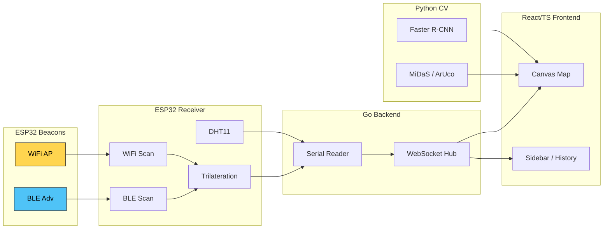

<div align="center">

# 📍 PULSAR by SWaP
## Система позиционирования в условиях отсутствия GPS

Гибридная система indoor‑позиционирования, объединяющая WiFi, BLE и Computer Vision. Полный стек: ESP32 → Go Backend (WebSocket) → React/TypeScript Frontend → Python CV.

</div>

---

<p align="center">
  
  
  
  
</p>

## Оглавление

- [О проекте](#о-проекте)
- [Киллер‑фичи](#киллер-фичи)
- [Архитектура](#архитектура)
- [Стек технологий](#стек-технологий)
- [Структура репозитория](#структура-репозитория)
- [Быстрый старт](#быстрый-старт)
  - [Запуск Backend (Go)](#запуск-backend-go)
  - [Запуск Frontend (React/TS)](#запуск-frontend-reactts)
  - [Запуск CV‑модуля (Python)](#запуск-cv-модуля-python)
  - [Демо без устройств](#демо-без-устройств)
- [Прошивка ESP32](#прошивка-esp32)
  - [Маяк (WiFi + BLE)](#маяк-wifi--ble)
  - [Приёмник (сканер)](#приёмник-сканер)
  - [Калибровка и команды](#калибровка-и-команды)
- [Интерфейс и визуализация](#интерфейс-и-визуализация)
- [Точность, производительность, масштабирование](#точность-производительность-масштабирование)
- [Требования](#требования)
- [FAQ](#faq)
- [Лицензия](#лицензия)

---

## О проекте

PULSAR — комплексная система позиционирования для помещений и зон без GPS. Решение объединяет радиомаяки (WiFi + BLE) и компьютерное зрение (Faster R‑CNN + MiDaS + ArUco) с умным сенсорным fusion, обеспечивая устойчивость и точность позиционирования в режиме реального времени.

Типичные сценарии:
- навигация дронов/роботов в помещениях;
- отслеживание персонала и техники на складах/заводах;
- системы безопасности и логистики indoor.

▶ Демонстрационное видео/материалы: [Yandex.Disk](https://disk.yandex.ru/d/cFXcTWYuW0c8VQ)

## Киллер‑фичи

- Адаптивный сенсорный fusion: веса WiFi/BLE зависят от их текущей точности (обратно пропорционально error).
- Калибровка в реальном времени через Serial‑команды, сохранение в EEPROM (включая координаты маяков).
- Медианный фильтр с отсечкой выбросов (±20 см) + буфер сглаживания траектории.
- Фильтр физически невозможных перемещений (ограничение скорости, анти‑«прыжки»).
- Двойное излучение маяков: WiFi AP + BLE Advertising на ESP32.
- Два режима CV: без маркеров (детекция объекта) и с ArUco (визуальные маяки) + оценка глубины MiDaS.
- WebSocket Hub для множественных клиентов, демо‑режим без устройств.
- Полностью адаптивный фронтенд (мобильный/планшет/десктоп) с плавной анимацией.

## Архитектура

```
┌──────────────┐     ┌────────────────┐     ┌─────────────────┐
│ ESP32 маяки  │     │ ESP32 приёмник │     │   Go Backend    │
│  WiFi + BLE  │ ──▶ │  WiFi/BLE scan │ ──▶ │  WebSocket Hub  │
└──────────────┘     │  Trilateration │     │  Serial Reader  │
                     └────────────────┘     └────────┬────────┘
                                                     │
                               ┌─────────────────────┴────────────────────────┐
                               │                                              │
                        ┌───────────────┐                               ┌─────────────┐
                        │  CV (Python)  │ ──────────► Optional data ───►│  Frontend   │
                        │ Faster R‑CNN  │                               │ React/TS    │
                        │ MiDaS / ArUco │◄────────── WebSocket ◄────────│ Canvas Map  │
                        └───────────────┘                               └─────────────┘
```



## Стек технологий

- Hardware: ESP32 DEVKIT V1 (4 шт: 3 маяка + 1 приёмник), DHT11, камера
- Backend: Go, Gorilla WebSocket, go.bug.st/serial, собственный logger
- Frontend: React, TypeScript, Canvas API, адаптивная верстка
- CV: Python, PyTorch, torchvision, OpenCV (aruco), MiDaS
- Протоколы/радио: WiFi AP, BLE Advertising

### Требования (версии)

| Компонент | Минимальная версия |
|---|---|
| Go | 1.21 |
| Node.js | 18 |
| Python | 3.8 |
| ESP32 SDK/Arduino Core | 2.x |
| OpenCV (contrib) | 4.10+ |
| PyTorch | 2.0+ |

## Структура репозитория

```text
PULSAR/
  backend/               # Go backend (WebSocket, Serial, логирование)
    cmd/main.go
    pkg/logger/logger.go
  frontend/              # React/TypeScript UI (визуализация, адаптив)
    src/App.tsx
    index.html, styles
  sketch_beacon/         # ESP32 маяк (WiFi AP + BLE рекламирование)
  sketch_reciever/       # ESP32 приёмник (сканирование, trilateration, JSON)
  main.py                # CV трекинг (Faster R-CNN + MiDaS + ArUco)
  cv-solution-readme.md  # Подробности CV‑части
```

### Запуск Backend (Go)

Требуется Go 1.21+.

```bash
cd backend/cmd
go run main.go
# WebSocket: ws://localhost:8080/ws
# Тестовая страница: http://localhost:8080/
```

### Запуск Frontend (React/TS)

Node 18+.

```bash
cd frontend
npm install
npm run dev
# Откройте: http://localhost:5173
```

### Запуск CV‑модуля (Python)

Python 3.8+, CUDA (опционально).

```bash
pip install torch torchvision opencv-contrib-python numpy pillow
python main.py
```

---

## Галерея / Demo

> Полная демонстрация доступна на Yandex.Disk: [ссылка](https://disk.yandex.ru/d/cFXcTWYuW0c8VQ)

## Прошивка ESP32

### Маяк (WiFi + BLE)

Файл: `sketch_beacon/sketch_beacon.ino`
- Поднимает WiFi AP `Beacon_<ID>` и BLE рекламу `BLE_Beacon_<ID>`
- Регулярно мигает встроенным светодиодом количеством раз = ID (для визуальной идентификации)

Параметры:
- `#define BEACON_ID 3` — номер маяка (1..3)

### Приёмник (сканер)

Файл: `sketch_reciever/sketch_reciever.ino`
- Сканирует WiFi/BLE для SSID/имён маяков, переводит RSSI → расстояние
- Трилатерация (3 маяка) для получения (x, y) и точности
- Сглаживание: медиана с отсечкой выбросов, буфер траектории, ограничение скорости
- Считывает DHT11 и добавляет `environment` (temperature, humidity)
- Отправляет JSON в Serial, который backend транслирует в WebSocket

### Калибровка и команды

Команды отправляются в Serial приёмника (115200):

```text
# Калибровка RSSI → расстояние
cal_wifi_05 <beaconId 1..3> <rssi>   # RSSI на 0.5 м
cal_wifi_1  <beaconId 1..3> <rssi>   # RSSI на 1.0 м
cal_ble_05  <beaconId 1..3> <rssi>   # RSSI на 0.5 м
cal_ble_1   <beaconId 1..3> <rssi>   # RSSI на 1.0 м

# Позиции маяков (метры); сохраняются в EEPROM
set_beacon_pos <beaconId> <x> <y>
save_beacons
load_beacons

# Режимы работы фильтров
set_mode fast     # меньше сглаживания, выше отзывчивость
set_mode stable   # больше сглаживания, выше стабильность

# Сброс позиции
reset_position
```

EEPROM используется для хранения калибровок и координат маяков.

## Интерфейс и визуализация

Файл: `frontend/src/App.tsx`
- Карта на Canvas с сеткой, позиция объекта, круг точности, траектория
- Позиции WiFi/BLE маяков, радиусы сигналов
- Боковые панели: позиция, окружение, веса fusion, списки маяков
- История перемещений с порогом значимости шага
- Мобильный/планшетный/десктопный режимы, плавная анимация

## Точность, производительность, масштабирование

- Точность: ±0.05–2.0 м (зависит от условий/калибровки/экранирования)
- Обновление: ~1 Гц (скан интервал 1000 мс)
- CV: Faster R‑CNN + MiDaS (интервальные вызовы для баланса FPS)
- Масштабирование: несколько клиентов через WebSocket Hub; площадь 10×10 м (референс), далее — добавлением маяков/зон
- Degradation: WiFi‑only / BLE‑only при пропаже одного канала, авто‑fusion при обоих

## Требования

- ESP32 DEVKIT V1 × 4 (3 маяка + 1 приёмник)
- DHT11 на приёмнике (GPIO 4) — опционально
- Go 1.21+, Node 18+, Python 3.8+
- Камера для CV (опционально), CUDA (опционально)

## FAQ

**Q: Что делать, если порт `/dev/ttyUSB0` другой?**  
A: Запустите backend с аргументом: `go run main.go /dev/ttyUSB1`.

**Q: Как улучшить точность?**  
A: Выполните калибровку RSSI (0.5м/1м) для каждого маяка, проверьте размещение маяков (не на одной линии), используйте режим `stable`.

**Q: Можно ли добавить больше маяков?**  
A: Да, но потребуется расширить код трилатерации/фьюжна (сейчас 3 маяка). UI готов к расширению.

**Q: Как подключить CV‑данные к общему fusion?**  
A: Сейчас CV отображается в UI (опционально). Интеграцию в общий fusion можно добавить через расширение формата WebSocket‑сообщений.

**Q: Можно ли запустить без железа?**  
A: Да. Backend сгенерирует тестовые данные, frontend их визуализирует.

---

## Контакты

- Email: yagadanaga@ya.ru
- Telegram: [Yagolnik Daniil](https://t.me/Alwaysxdroll)
- Репозиторий: GitHub (будет опубликован)

## Security / Responsible Disclosure

Выделенного контакта для вопросов безопасности сейчас нет. По общим вопросам используйте email.

## Лицензия

All Rights Reserved. Код является проприетарным. Любое использование, копирование, изменение, распространение или сублицензирование без письменного разрешения правообладателя запрещено. См. файл `LICENSE`.

— Команда SWaP
